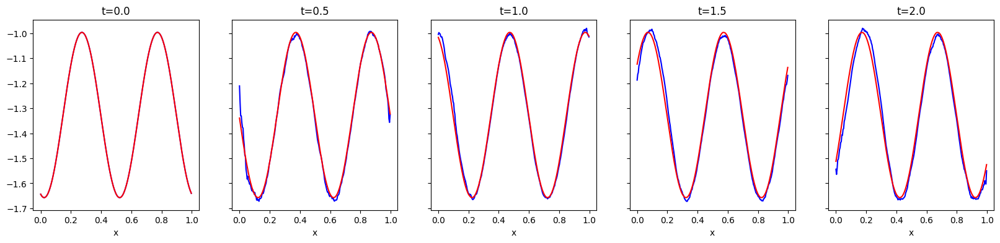
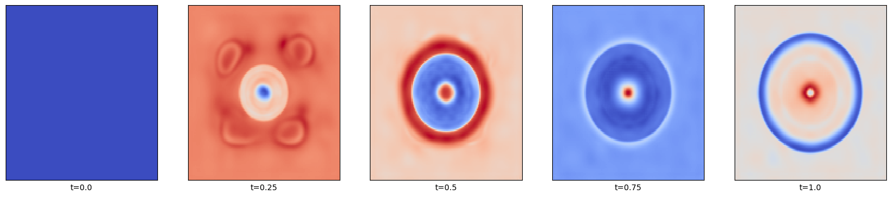

# U-Net PDE Solver

## 简介

UNet是一种具有编码器-解码器结构的卷积神经网络，最初被用于医学图像分割任务，并随后被广泛应用于多种图像到图像的任务，如图像的超分辨率和在扩散模型中的去噪。近年来，UNet也开始被用于解决偏微分方程相关的问题。

在将UNet应用于PDE求解中，通常会仿照传统的数值方法，将PDE的求解空间域离散化为多个网格。此时，方程在每个时刻 $`t`$​ 的解可以被视为一张图像，解函数在每个位置处的值可以被视为图像的像素值。因此，可以利用UNet学习从已知时刻的解到未知时刻的解的映射来求解偏微分方程问题。 UNet的能力在于通过学习从已知的空间域解到未知时刻的解之间的映射关系，实现对复杂偏微分方程的高效求解。

### 模型结构


### 求解框架

UNet基于方程前 $`l`$ 个时间步的解 $`{\hat{u}^{k-l+1},...,\hat{u}^k}`$ 预测下一个时间步 $`\hat{u}^{k+1}`$ 的解，该过程可以公式化为：

```math
\hat{u}^{k+1} = \text{U-Net}(\hat{u}^{k-l+1:k};\theta).
```

在推理时时，前 $`l`$ 个时间步的解表示为 $`\{u^0,...,u^{l-1}\}`$，由高精度数值方法生成，它们是模型的初始输入。其余时间步的解由模型自回归地生成（即其余时间步的输入会包括模型的预测值）。

### 损失函数

将UNet模型记作 $`f_{\theta}`$ ，$`\theta`$ 为模型可学习的参数，模型基于前 $`l`$ 个时间步的解 $`{\hat{u}^{k-l+1},...,\hat{u}^k}`$ 预测下一个时间步 $`\hat{u}^{k+1}`$ 的解：

```math
\hat{u}^{k+1} = f_{\theta}(\hat{u}^{k-l+1},...,\hat{u}^k).
```


损失函数的一般形式为：

```math
\mathcal{L}=\frac{1}{N}\sum_{k=0}^{N-1}\mathcal{L}_{\text{data}}(f_{\theta}(\hat{u}^{k-l+1},...,\hat{u}^k), u^{k+1})
```

其中 $`u^{k+1}`$ 是由高阶数值方法生成的，$`\mathcal{L}_{\text{data}}`$​ 可以是均方误差（Mean Squared Error，MSE）和均方根误差（Root Mean Squared Error，RMSE）等用于衡量模型预测值与真实值之间误差程度的损失函数。在本实现中，我们使用MSE作为损失函数。

### 训练方法

假设一个空间维度为2的方程真解数据形状为 $`(N_t, N_x, N_y, N_d)`$，$`N_t`$为时间步的步数（也称作时间分辨率），$`N_x,N_y`$为空间沿$`x`$和沿$`y`$方向的采样点的个数（$`N_x \times N_y`$也称为空间分辨率），$`N_d`$为方程待求解的变量个数。训练时，取前 $`l`$ 个时刻的解作为模型的输入，输入resize为形状 $`(l\times N_d,N_x,N_y)`$ 的tensor，类似图片的 $`(C,H,W)`$。模型输出的形状为 $`(N_d, N_x, N_y)`$，表示第 $`(l+1)`$ 时刻 $`N_d`$ 个变量在空间域上的解。根据每次输入模型的数据是否为真实数据，可以将训练方法分为单步训练法和自回归训练：

**单步训练**：每次模型的输入总是来自数据集（ground truth），每一步推理的损失可以写作：

```math
\mathcal{L}_{\text{single}}=\mathcal{L}_{\text{data}}(f_{\theta}(u^{k-l+1},...,u^k), u^{k+1}).
```

如果推理了$`(N_t-l)`$次，累积平均损失可以写作：

```math
\mathcal{L}=\frac{1}{N}\sum_{k=0}^{N_t-l}\mathcal{L}_{\text{single}}=\frac{1}{N}\sum_{k=0}^{N_t-l}\mathcal{L}_{\text{data}}(f_{\theta}(u^{k-l+1},...,u^k), u^{k+1}).
```

**自回归训练**：只有第一次模型的输入来自数据集，剩下的输入由模型推理得到。因此，推理了$(N_t-l)$ 次的累积平均损失可以写作：

```math
\mathcal{L}=\frac{1}{N}\sum_{k=0}^{N_t-l}\mathcal{L}_{\text{data}}(f_{\theta}(\hat{u}^{k-l+1},...,\hat{u}^k), u^{k+1})
```

## 快速开始

### 配置环境

创建新的conda环境并安装如下依赖

- Python 3.8
- CUDA 11.6
- PyTorch 1.13.1

安装命令实例：

```bash
# create environment
conda create -n PDENNEval python=3.8 
conda activate PDENNEval

# install pytorch
conda install pytorch==1.13.1 pytorch-cuda=11.6 -c pytorch -c nvidia

# to read dataset file in HDF5 format
pip install h5py

# visualization
pip install tensorboard matplotlib tqdm 
```

### 数据准备

这里使用[PDEBench](https://arxiv.org/abs/2210.07182)的数据来训练和测试模型，实现中提供的数据读取代码主要用于读取PDEBench格式的代码。PDEBench提供了涵盖多个方程的数据集，可以从[DaRUS data repository](https://darus.uni-stuttgart.de/dataset.xhtml?persistentId=doi:10.18419/darus-2986)下载这些数据。如果你在研究中使用了PDEBench的数据，请引用他们的工作：

<details>
<summary>
    <a href="https://arxiv.org/abs/2210.07182">PDEBench: An Extensive Benchmark for Scientific Machine Learning - NeurIPS'2022 </a>
</summary>
<br/>

```
@inproceedings{PDEBench2022,
author = {Takamoto, Makoto and Praditia, Timothy and Leiteritz, Raphael and MacKinlay, Dan and Alesiani, Francesco and Pflüger, Dirk and Niepert, Mathias},
title = {{PDEBench: An Extensive Benchmark for Scientific Machine Learning}},
year = {2022},
booktitle = {36th Conference on Neural Information Processing Systems (NeurIPS 2022) Track on Datasets and Benchmarks},
url = {https://arxiv.org/abs/2210.07182}
}
```

</details>


<details>
<summary>
    <a href="https://doi.org/10.18419/darus-2986">PDEBench Datasets - NeurIPS'2022 </a>
</summary>
<br/>

```
@data{darus-2986_2022,
author = {Takamoto, Makoto and Praditia, Timothy and Leiteritz, Raphael and MacKinlay, Dan and Alesiani, Francesco and Pflüger, Dirk and Niepert, Mathias},
publisher = {DaRUS},
title = {{PDEBench Datasets}},
year = {2022},
doi = {10.18419/darus-2986},
url = {https://doi.org/10.18419/darus-2986}
}
```
</details>

### 配置文件

`config`目录包含多个`yaml`配置文件，命名格式为`config_{1/2/3}D_{PDE名称}.yaml`，其中保存了所有用于训练和测试的参数。部分参数的解释如下：

- 训练参数：
    - `training_type`：str，设置为`autoregressive`以使用自回归损失进行自回归训练，或者设置为`single`以使用单步损失进行单步训练。
    - `pushforward`：bool，设置为`True`以进行推进训练。同时，`training_type`也必须设置为`True`。
    - `initial_step`：int，模型输入时间的步数 $l$。（默认值：10）
    - `unroll_step`：int，使用pushforward trick时要反向传播的时间步数$M$。（默认值：20）
- 模型参数：
    - `in_channels`：int，要求解的变量数量。例如，对于1D可压缩Navier-Stokes方程，有3个要求解的变量：密度、压力和速度，该值就设置为3。
    - `out_channels`：int，等于`in_channels`的输出通道数。
    - `init_features`：int，U-Net中第一个上采样块中的通道数。

其余的参数分别是数据集、dataloader、optimizer和learning rate scheduler相关的参数，参数的意思比较显然。

### 训练

1. 检查配置文件中的参数

    1. 检查配置文件中的参数，确保`file_name` 和`saved_folder`对应数据文件名和文件存放路径；

    2. 确保配置文件中的`if_training`设置为`True`；

2. 调整训练的超参数，例如学习率`lr`，批量大小`batch_size`，训练epoch数`epochs`等；

3. 运行如下命令：

    ```bash
    CUDA_VISIBLE_DEVICES={your_cuda_id} python train.py ./config/{config_file_name}
    ```

### 测试

1. 修改配置文件

    1. 设置`model_path`的路径为模型checkpoint的路径；

    2. 设置`if_training`为`False`；

2. 运行如下命令：

    ```bash
    CUDA_VISIBLE_DEVICES={your_cuda_id} python train.py ./config/{config_file_name}
    ```

## 结果可视化

我们提供了求解1维和2维方程结果可视化的代码，前提是需要先训练好模型，详情参见`visualize_1d_inference.ipynb`和`visualize_2d_inference.ipynb`。

例如：求解1D Advection方程的结果，横轴表示求解空间域，每一个子图对应不同时刻，真解（红色）和预测解（蓝色）的值。



例如：求解2D浅水方程的结果，下图为真解和预测解的残差。

